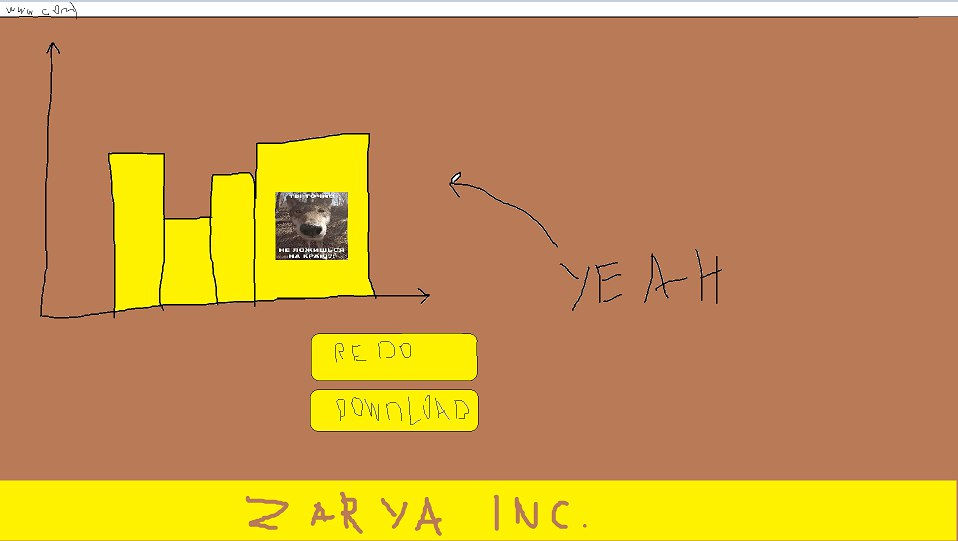

# Описание проекта

Этот проект создан для автоматизации работы с данными компании ООО Яблоко

## Цель

Создать ПО для автоматизации подготовки данных для презентаций

## Задачи

- Проализировать стуктуру файлов xlsx
- Создать обработчик данных для приобразования данных в графики
- Сделать графический интерфейс для отображения графиков, а так же возможность их выгружать

## Основные требования

- Скорость обработки
- Возможность читать файлы разрешениями .obd .xlsx
- Размещеность в интернете для быстрой доступности всех сотрудникам компании

## Разработчики

- Колтунов Сергей
- Рыбальченко Никита
- Толстов Андрей
- Чебунькова Вероника

## Как пользоваться ?

1. Открываем сайт

2. Загружаем таблицу


3. Получаем графики



4. ???

5. PROFIT

# Запуск проекта

## Общие требования

- Docker
- Docker Compose

Перед запуском убедитесь, что у вас установлены Docker и Docker Compose.

## Подготовка к запуску

1. Склонируйте репозиторий проекта.
2. Перейдите в каталог проекта.
3. Создайте файл `.env` на основе файла `.env.example` и заполните необходимые значения.
4. Незабудте про телеграм api-key

```bash
cp .env.example .env
```

## Запуск на различных операционных системах

### Windows

Откройте командную строку или PowerShell и выполните следующие команды:

```bash
cd путь_к_проекту
```

```bash
docker-compose -f docker-compose.yml up --build --force-recreate
```

### Linux или MacOS

Откройте терминал и выполните следующие команды:

```bash
cd путь_к_проекту
```

```bash
make dev
```
